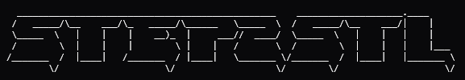

<div align="center">

<br/>




### Convert `.step` / `.stp` to `.stl` - entirely in your browser.

No installs. No uploads. No server. No sign-up. Just drag, drop, and download.

<br/>

[](#-license)


<br/>

### [▶ &nbsp; Open STEP2STL](https://iamjrmh.github.io/STEP2STL/)

<br/>

</div>

---

## What it does

Drop a folder or a handful of `.step` / `.stp` files onto the page, hit **Convert & Download ZIP**, and instantly get back a tidy `.zip`:

```
📦 your_download.zip
├── part_a.stl
├── part_b.stl
└── originals/
    ├── part_a.step
    └── part_b.step
```

STLs land at the root for easy slicing. Your originals are tucked in `originals/` in case you ever need them back. **Your files never leave your machine** - conversion runs entirely inside the browser tab.

---

## Quick start

```
1. Drop a folder or files onto the drop zone
2. Click "Convert & Download ZIP"
3. Done
```

Folders are scanned **recursively** - drop an entire project directory and every `.step` / `.stp` file inside it gets picked up automatically.

> **First run takes ~5-10 seconds** while the CAD kernel (a ~6 MB WebAssembly module) loads. Your browser caches it after that, so every conversion afterward starts instantly.

---

## How it works

STEP2STL is powered by **[occt-import-js](https://github.com/kovacsv/occt-import-js)**, a WebAssembly build of [OpenCASCADE](https://www.opencascade.com/) - the same geometry kernel behind FreeCAD, Salome, and professional CAD tooling. The STEP file is parsed and tessellated entirely on your CPU inside the browser tab, then the resulting triangle mesh is assembled into binary STL.

| | |
|:---:|:---|
| 🔒 | **Private by design** - nothing is uploaded, ever |
| 📦 | **Zero install** - just open the URL and go |
| ⚡ | **Batch conversion** - drop a whole folder, get a whole ZIP |
| 🔁 | **Recursive scan** - nested folders, no problem |

---

## Supported formats

| Input | Output |
|:---:|:---:|
| `.step` | `.stl` (binary) |
| `.stp` | `.stl` (binary) |

Multi-body and assembly STEP files are supported. Mesh quality defaults to a solid general-purpose setting suited for 3D printing and visual review.

---

## Browser compatibility

Any modern browser with WebAssembly support works:

| Browser | Supported |
|:---|:---:|
| Chrome / Edge 89+ | ✅ |
| Firefox 89+ | ✅ |
| Safari 15+ | ✅ |
| Mobile Chrome / Safari | ✅ *(large files may be slow)* |

---

## Running locally

No build step needed - just serve the files with any local server (required for WASM to load):

```bash
# Python
python -m http.server 8080

# Node
npx serve .
```

Then open **http://localhost:8080**.

---

## License

MIT - do whatever you want with it.

---

<div align="center">
<br/>
<sub>Built on top of <a href="https://github.com/kovacsv/occt-import-js">occt-import-js</a> and <a href="https://www.opencascade.com/">OpenCASCADE</a></sub>
<br/><br/>
</div>
